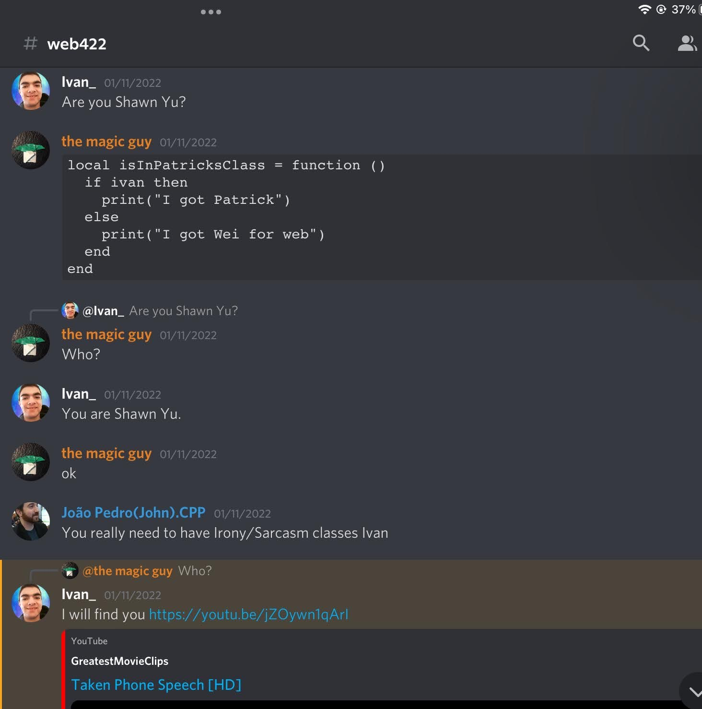

# Debate dragon 2.0

A blazingly fast discord bot written in Go to burn your debate foes to the ground

## Commands

`/are-u-shawn-yu` - Recreates the following image:

`/caramel-bot-bitch user: <user>` - calls a user a bitch.

`/caramel-bot-compliment user:<user>` - give a compliment to the user

`/courseoutline course_code:<code>` - get the course outline for a course by the course code

`/dd text:<text>` - generate a dragon drawing, with `text` imposed into the speech bubble

`emote name:<name>` - send custom emotes

`/insult user:<userName> anonymous: <true | false>`: Send an insult to `userName`. `anonymous` determines if you'll be shown as the person that executed the command

`/mock user:<user>` - make fun of a user's last sent message anonymously. You will not be shown as the person that executed the slash command

`/reddit` - get a random post from r/seneca

`/rmp profname: <name>`: search for a professor by name from Seneca college. If more than 1 professor by that name at Seneca, a select menu will be displayed to prompt to select the prof to display the ratings of. Other wise, the prof's ratings will be displayed.

`/snipe` - get the last deleted message in a server

`/stfu user:<user> length:<length>` - for every message a user sends, the bot will ping the user telling them to stfu

## Development

The bot requires a `config.json` to set environment variables. Refer to `config.example.jsonc` for all values needed in `config.json`.

**Note** the actual config should be a json file. The `config.example.jsonc` is `jsonc` only to allow comments
