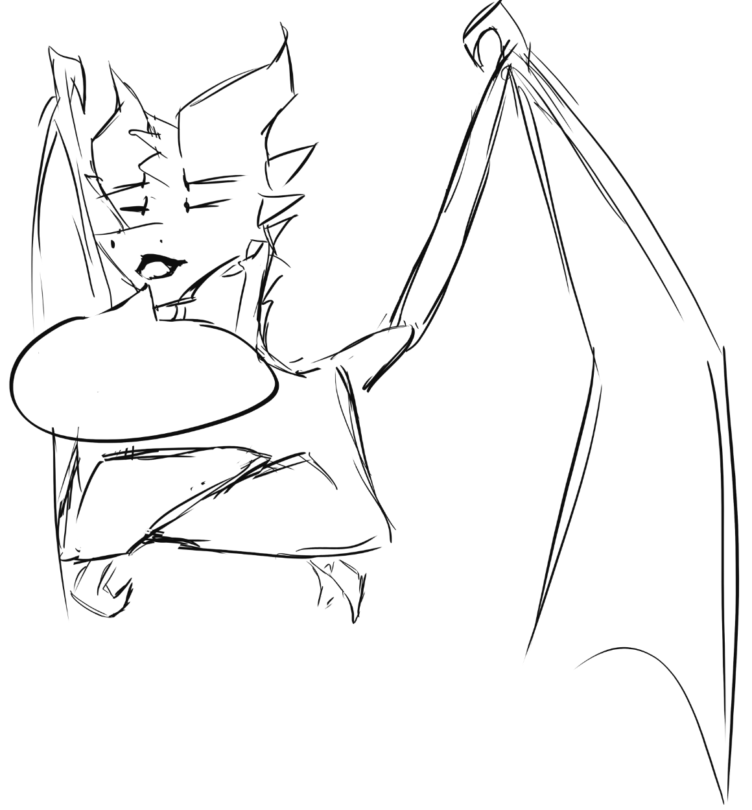

# Debate dragon 2.0

A blazingly fast discord bot written in Go to burn your debate foes to the ground

`/dd text:<text>` - generate a dragon drawing, with `text` imposed into the speech bubble

`/insult user:<userName> anonymous: <true | false>`: Send an insult to `userName`. `anonymous` determines if you'll be shown as the person that executed the command

