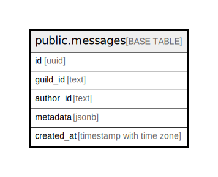

# public.messages

## Description

Table containing all messages send in all guilds this bot is in

## Columns

| Name | Type | Default | Nullable | Children | Parents | Comment |
| ---- | ---- | ------- | -------- | -------- | ------- | ------- |
| id | uuid |  | false |  |  |  |
| guild_id | text |  | false |  |  | Guild ID this message came from |
| author_id | text |  | false |  |  | Author ID this message came from |
| metadata | jsonb |  | false |  |  | JSON encoded string, containg other properties, such as image and attachments |
| created_at | timestamp with time zone | now() | false |  |  | Timestamp the message was created at |
| deleted | boolean | false | false |  |  |  |

## Constraints

| Name | Type | Definition |
| ---- | ---- | ---------- |
| messages_author_id_not_null | n | NOT NULL author_id |
| messages_created_at_not_null | n | NOT NULL created_at |
| messages_deleted_not_null | n | NOT NULL deleted |
| messages_guild_id_not_null | n | NOT NULL guild_id |
| messages_id_not_null | n | NOT NULL id |
| messages_metadata_not_null | n | NOT NULL metadata |
| messages_pkey | PRIMARY KEY | PRIMARY KEY (id) |

## Indexes

| Name | Definition |
| ---- | ---------- |
| messages_pkey | CREATE UNIQUE INDEX messages_pkey ON public.messages USING btree (id) |

## Relations

---

> Generated by [tbls](https://github.com/k1LoW/tbls)
